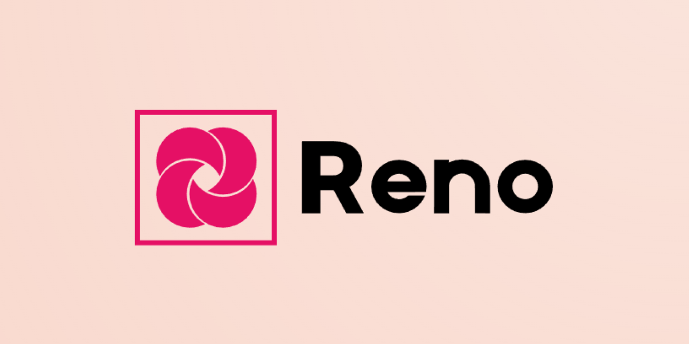

  

# Reno-Vans
> __"Quaestio Tua, Scientiam Renovans."__

###

  

###

<!--
style path: src/repo/svg/bar.svg

In case of update:

Available:

Unavailable:

In Development:

-->

### Models
1. __Reno-Orion Nous__ 
   - Naming Convention: Orion (strength/versatility) + Nous (intellect/understanding).
   - Description:
     - Our flagship general-purpose AI. Reno-Orion Nous combines raw processing power with deep cognitive abilities. It excels in complex reasoning, problem-solving, and handling a wide range of tasks. Think of it as a powerful and deeply intelligent partner.

2. __Reno-Aquila Ingenium__ 
   - Naming Convention: Aquila (vision/swiftness) + Ingenium (ingenuity/resourcefulness).
   - Description:
     - Optimized for analytical tasks, data processing, and rapid problem-solving. Reno-Aquila Ingenium is highly efficient and capable of finding innovative solutions. Imagine a very fast and creative problem solver, adept at extracting insights and generating novel approaches.

3. __Reno-Lyra Veritas__ 
   - Naming Convention: Lyra (harmony/creativity) + Veritas (truth)
   - Description:
     - Designed for creative tasks that require accuracy and factual grounding. Reno-Lyra Veritas excels in producing outputs that are both beautiful and correct. Consider it a creative writer or artist with the precision of a fact-checker

###

  

###

  
  <!-- Project Status & Version -->
  
  
  
  
  <!-- Core Models -->
  
  
  
  
  
  <!-- Core Technologies -->
  
  
  
  
  <!-- Main Features -->
  
  
  
  
  <!-- Technical Implementation -->
  
  
  
  
  
  <!-- Optimization -->
  
  
  
  
  <!-- Tech Stack -->
  
  
  
  
  
  <!-- Social -->
  

###

  

###

## Overview

Reno‑Vans is an advanced AI ensemble system designed for automated webpage creation. By integrating multiple pre‑trained models through a robust, iterative refinement process, Reno‑Vans produces high‑quality, semantically accurate webpages with exceptional UI/UX. The system eschews traditional datasets by synthesizing its own training data and continuously improves its outputs through Reinforcement Learning from AI Feedback (RLAIF) and optional Human Feedback (RLHF). Recent updates (RE‑2) have optimized the system for maximum speed and resource efficiency, incorporating state‑of‑the‑art quantization, attention caching, and pipeline optimizations.

---

## Hardware Target

- **Processor:** Intel Core i5‑12450H  
- **GPU:** GeForce RTX 3060 4GB  
- **Storage:** 2TB SSD  

---

## Model Architecture

### Primary Model  
- **bigcode/StarCoder2-3b**  
  - The core code generator trained extensively on web development repositories.
  - Operates in 4‑bit quantization (via GPTQ) for optimal speed and memory efficiency.
  - Excels in generating HTML, CSS, and JavaScript with semantic awareness and robust infilling capabilities.

### Secondary Model  
- **google/codegemma-2b**  
  - A lightweight, fast model for inter‑model evaluation and candidate refinement.
  - Runs in 4‑bit quantization (via bitsandbytes/GGUF) to minimize overhead.
  - Provides rapid feedback to drive the deep thinking cycle.

### Evaluator (RLAIF)  
- **microsoft/Phi‑2**  
  - Serves as the RLAIF evaluator providing detailed, structured feedback.
  - Utilizes 8‑bit quantization to reduce memory consumption while maintaining accuracy.
  - Scores outputs based on correctness, design principles, execution, and static analysis.

### Reinforcement (IR‑NLP)  
- **sentence‑transformers/all‑MiniLM‑L12‑v2**  
  - Generates lightweight, high‑quality FP16 embeddings.
  - Supports fast reference retrieval via a FAISS‑backed index and aggressive caching.
  - Enhances reinforcement learning by precomputing embeddings for IR tasks.

---

## Learning Paradigms

### 1. Reinforcement Learning from AI Feedback (RLAIF)
- **Strategy:**  
  - The system employs an AI‑generated self‑critique loop where models assess each other’s outputs.
  - **microsoft/Phi‑2** provides detailed feedback which is used to rank alternatives.
  - Reward signals are generated based on simulated execution, static analysis, and advanced metrics.
  - Gradient updates incorporate feedback into the model weights continuously.

- **Architecture:**  
  - **Primary:** bigcode/StarCoder2‑3b  
  - **Secondary:** google/codegemma‑2b  
  - **Evaluator:** microsoft/Phi‑2  
  - Automatic debugging is integrated via language‑model powered DebuggerAgents.

### 2. Reinforcement Learning from Human Feedback (RLHF) (Optional)
- **Strategy:**  
  - Provides an optional interface for collecting human feedback.
  - A preference model is built to adjust generation parameters dynamically.
- **Framework:**  
  - Uses standardized evaluation criteria and long‑term feedback tracking.

### 3. IR‑NLP Enhancements
- **Strategy:**  
  - Lightweight embeddings from **sentence‑transformers/all‑MiniLM‑L12‑v2** are precomputed and stored using FAISS.
  - Aggressive caching and approximate retrieval methods optimize IR performance.

---

## Pipeline and Software Optimizations

- **Optimized Inference:**  
  - Integration with accelerated inference frameworks such as **vLLM/llama.cpp** and **ExLlama‑v2**.
- **Attention & KV‑cache:**  
  - Leverages **FlashAttention‑2**, **xFormers**, and **PagedAttention** for efficient attention computations and reduced memory usage.
- **Memory Management:**  
  - Implements CPU‑GPU offloading, gradient checkpointing, and tensor parallelism.
  - Sequential model loading/unloading and continuous batching ensure efficient VRAM usage.
  - Disk‑based checkpointing aids in rapid recovery.
- **IR‑NLP Caching:**  
  - Uses a FAISS‑based index for fast similarity search and aggressive caching of precomputed embeddings.

---

## Ensemble Integration

### Logistic Regression Ensemble
A dedicated logistic regression layer combines features from:
- **Primary confidence:** Derived from token‑ and sequence‑level entropy.
- **Secondary confidence:** Measured via ensemble disagreement between primary and secondary outputs.
- **Evaluator confidence:** Computed from evaluator model entropy.
- **Raw entropy values, disagreement scores, KNN similarity,** and **example quality metadata**.
  
This ensemble layer produces a final score that guides iterative refinement and training.

### Deep Thinking Cycle
The system generates multiple candidate refinements using the secondary model. Candidates are scored via the ensemble logistic regression layer, and the best candidate is selected based on highest aggregated score.

### Cross‑Model Alignment
Projection layers map hidden states from each model into a common space. An adversarial perturbation strategy is applied to optimize cosine similarity, ensuring consistent knowledge transfer across models.

### Automatic Debugging
A dedicated DebuggerAgent automatically generates detailed debugging reports when evaluation scores are low, with caching to avoid redundant computations.

### Advanced Knowledge Distillation
A student MLP is trained to mimic the ensemble output, distilling the knowledge of the entire system into a compact model.

---

## Evaluation Metrics

1. **Code Execution Success Rate:**  
   - Percentage of generated code that executes without errors across multiple browsers.

2. **Code Quality Metrics:**  
   - Adherence to coding standards, complexity, maintainability, and security vulnerability assessments.

3. **Functional Correctness:**  
   - Accuracy of implementation against specifications and edge case handling.

4. **UI/UX User Satisfaction:**  
   - Measured via standardized usability tests and subjective ratings.

5. **Accessibility Metrics:**  
   - 100% compliance with WCAG 2.1 AA standards.

6. **Layout and Design Quality:**  
   - Evaluation of visual hierarchy, typography, color harmony, and responsive behavior.

7. **Ensemble Consistency:**  
   - Coherence between design intent and code implementation.

8. **Overall Task Performance:**  
   - End-to-end solution completeness, integration effectiveness, and resource efficiency.

9. **Error Rate:**  
   - Frequency and severity of system failures.

10. **Prompt Engineering Evaluation:**  
    - Ability to interpret and follow varied instructions accurately.

11. **RLAIF Effectiveness:**  
    - Quality improvements from AI feedback.

12. **RLHF Alignment (Optional):**  
    - Correlation between system behavior and human preferences.

---

## Risk Management & Continuous Improvement

- **Automated Testing:**  
  - Static analysis, dynamic testing, UI regression, and load testing pipelines.
- **Error Targets:**  
  - Code execution success >98%; ensemble error rate <3% critical errors.
- **Performance:**  
  - Full webpage generation in <12 seconds, memory usage <10GB, API latency <120ms.
- **Continuous Learning:**  
  - Iterative refinement, cross‑model synchronization, and regular knowledge distillation.

---

## Let Us Know!

For reporting issues or providing feedback, please contact us via [Email](mailto:relay.arbiter303@gmail.com) or open an issue on [GitHub](https://github.com/Protostarship/reno-vans/issues).

  

---

